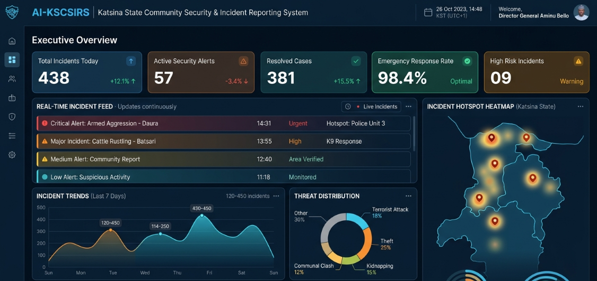

 <p align="center">
  
</p>
 
 
 
 # 🛡️ Katsina State Security & Incident Reporting System

> A real-time incident reporting and monitoring platform designed to improve communication, incident tracking, and response coordination through a modern, responsive web application.

 <p align="center">
  
  
  
  
  
  
  
  
  
  
</p>

---
# 🚀 Overview

Security incidents often go unreported or reach the appropriate authorities too late due to fragmented communication channels. The AI Katsina State Community Security & Incident Reporting System was designed as a modern digital platform that enables citizens to report incidents in real time while providing administrators with a centralized dashboard for monitoring, prioritizing, and responding to security events. By combining React, TypeScript, and Firebase, the platform demonstrates how modern cloud technologies can improve public safety through faster information sharing and real-time collaboration.

---

## 🚨 The Problem

Security incidents are often reported through fragmented communication channels such as phone calls, messaging apps, or in-person reports. These methods can delay response times, make incidents difficult to track, and limit visibility for decision-makers.

Without a centralized platform, security agencies may struggle to prioritize incidents, monitor ongoing reports, or maintain accurate historical records. Communities also have limited visibility into the status of incidents they report, reducing transparency and trust in the reporting process.

---

## 💡 The Solution

The AI Katsina State Community Security & Incident Reporting System (AI-KSCSIRS) was designed to modernize incident reporting through a secure, cloud-based web application.

The platform enables citizens to submit incidents in real time while providing administrators with a centralized dashboard to monitor reports, manage priorities, and coordinate responses. By combining React, TypeScript, and Firebase, the application demonstrates how modern web technologies can improve communication, operational efficiency, and public safety through reliable real-time synchronization.

Although the current version focuses on real-time reporting and monitoring, the project's long-term vision includes AI-powered incident classification, voice reporting, intelligent prioritization, and predictive analytics to further enhance emergency response workflows.

---

 ## ✨ Key Features

### 👥 Citizen Features

- 🚨 Report security incidents in real time
- 📍 Submit detailed incident information with location context
- 📷 Upload supporting evidence for incident reports (future enhancement)
- 🔄 Track incident status and updates
- 📱 Access the platform seamlessly across desktop and mobile devices
- 🔔 Receive real-time updates through Firebase synchronization

---

### 🛡️ Administrator Features

- 📊 Monitor incidents through a centralized dashboard
- 🏷️ Categorize incidents by type and priority
- 📈 View live incident activity as reports are submitted
- 👥 Manage incident records efficiently
- ⚡ Respond to changing situations using real-time data synchronization

---

### 🔐 Security Features

- 🔑 Secure authentication using Firebase Authentication
- 🛡️ Protected application routes
- ☁️ Cloud-based data storage with Firestore
- ⚡ Real-time synchronization using Firebase Realtime Database
- ✅ Client-side form validation for reliable data entry

---

### ⚙️ Engineering Features

- ⚛️ Component-based React architecture
- 📦 Modular and scalable project structure
- 🔄 Context API for global state management
- 🚀 Fast development workflow powered by Vite
- 📱 Responsive design built with Tailwind CSS
- 🧩 Reusable UI components for maintainability

---

### 🤖 AI Vision

The current version establishes the foundation for future AI-powered capabilities, including:

- 🗣️ Voice-to-text incident reporting
- 🤖 Automatic incident categorization
- 🚨 Intelligent priority prediction
- 📍 AI-assisted location suggestions
- 📊 Predictive incident analytics
- 🧠 Natural language processing for report analysis

---

 ## 🛠️ Technology Stack

### 🎨 Frontend

| Technology | Purpose |
|------------|---------|
| **React 19** | Builds a modern, component-based user interface with reusable and maintainable components. |
| **TypeScript** | Improves code quality through static typing, reducing runtime errors and making the application easier to maintain. |
| **Tailwind CSS** | Provides a utility-first styling approach for building responsive and consistent user interfaces efficiently. |
| **Vite** | Delivers an extremely fast development environment with optimized production builds. |
| **Context API** | Manages global application state without introducing unnecessary complexity for the project's scale. |

---

### ☁️ Backend & Cloud Services

| Technology | Purpose |
|------------|---------|
| **Firebase Authentication** | Provides secure user authentication and identity management. |
| **Cloud Firestore** | Stores structured incident data with scalable cloud-based NoSQL storage. |
| **Firebase Realtime Database** | Synchronizes live incident updates instantly across connected users. |
 

---

### ⚙️ Development Tools

| Tool | Purpose |
|------|---------|
| **Git** | Tracks project history and supports collaborative development. |
| **GitHub** | Hosts the source code, version control, and project documentation. |
| **Postman** | Tests APIs and validates backend service interactions during development. |
| **Visual Studio Code** | Primary development environment used throughout the project. |

---

### 🏗️ Architecture & Design

The project follows modern frontend engineering principles, including:

- ⚛️ Component-based architecture
- 📂 Modular folder organization
- 🔄 Centralized state management using Context API
- ☁️ Cloud-native backend powered by Firebase
- ⚡ Real-time synchronization for live incident monitoring
- 📱 Mobile-first responsive design
- ♻️ Reusable UI components
- 🔒 Secure authentication and protected routes

---

 ## 🏗️ System Architecture

The AI Katsina State Community Security & Incident Reporting System follows a cloud-native architecture built around React and Firebase. The frontend communicates securely with Firebase services, enabling authentication, persistent cloud storage, and real-time synchronization across connected users.

```text
                    ┌────────────────────────────┐
                    │        End Users           │
                    │ Citizens & Administrators  │
                    └─────────────┬──────────────┘
                                  │
                                  ▼
                    ┌────────────────────────────┐
                    │      React + TypeScript    │
                    │      Responsive Frontend   │
                    └─────────────┬──────────────┘
                                  │
                 ┌────────────────┴────────────────┐
                 │                                 │
                 ▼                                 ▼
        Context API                     Firebase Authentication
   (Global State Management)          (Secure User Login)
                 │
                 ▼
        Firebase Cloud Services
     ┌──────────────┬────────────────┐
     │              │                │
     ▼              ▼                ▼
 Cloud Firestore  Realtime DB    Firebase Storage*
 Incident Data    Live Updates   Evidence Uploads
                                     (*Future)
```

> **Architecture Overview**

- **Presentation Layer** – Built with React and TypeScript to deliver a responsive, component-driven user interface.
- **State Management Layer** – Context API manages shared application state across pages and reusable components.
- **Authentication Layer** – Firebase Authentication secures user access and protects application resources.
- **Data Layer** – Cloud Firestore stores structured incident records while Firebase Realtime Database provides instant synchronization between connected users.
- **Future AI Layer** – Designed to integrate AI-powered incident classification, predictive analytics, and intelligent response recommendations.

---

 ## 🏛️ Design Principles

The application was designed around several engineering principles:

- **Scalability** — Modular architecture allows new features to be added with minimal code duplication.
- **Maintainability** — Reusable React components and organized folder structures improve long-term development.
- **Performance** — Efficient rendering strategies minimize unnecessary React re-renders.
- **Reliability** — Firebase cloud infrastructure provides secure authentication and highly available data storage.
- **Responsiveness** — Mobile-first design ensures usability across desktops, tablets, and smartphones.
- **Developer Experience** — TypeScript and Vite provide fast development workflows and improved code quality.

---

# 📈 Performance Optimizations

- Reduced unnecessary React re-renders
- Optimized component composition
- Structured Firestore collections
- Form validation for reliable data submission
- Clean project architecture for future scalability

---

# 🎯 Project Impact

The platform improves the speed and reliability of incident reporting by providing a centralized, real-time communication system.

It was developed to demonstrate how modern web technologies can support operational coordination, improve reporting workflows, and deliver responsive user experiences.

---

# 📂 Project Structure

```
src/
├── assets/
├── components/
├── context/
├── hooks/
├── layouts/
├── pages/
├── services/
└── utils/
```

---

# 🚀 Getting Started

### Clone the repository

```bash
git clone https://github.com/Sinsydev/AI-KSCSIRS.git
```

### Navigate into the project

```bash
cd AI-KSCSIRS
```

### Install dependencies

```bash
npm install
```

### Start the development server

```bash
npm run dev
```

Open:

```
http://localhost:5173
```

---

# 🔐 Environment Variables

Create a `.env` file in the project root.

```env
VITE_FIREBASE_API_KEY=
VITE_FIREBASE_AUTH_DOMAIN=
VITE_FIREBASE_PROJECT_ID=
VITE_FIREBASE_STORAGE_BUCKET=
VITE_FIREBASE_MESSAGING_SENDER_ID=
VITE_FIREBASE_APP_ID=
VITE_FIREBASE_DATABASE_URL=
```

---

# 🛣️ Roadmap

- ✅ Real-time incident reporting
- ✅ Live monitoring dashboard
- ✅ Authentication system
- ✅ Responsive interface

### Planned

- Role-based access control
- Push notifications
- Analytics dashboard
- Offline reporting
- Incident history export
- Activity logging
- Multi-language support

---

# 🧪 Build for Production

```bash
npm run build
```

---

# 🤝 Contributing

Contributions, suggestions, and feedback are welcome. Feel free to open an issue or submit a pull request.

---

# 👨‍💻 Author

**Ismail Aminu Said**

🌐 Portfolio: https://ismailaminusaid.netlify.app

💼 LinkedIn: https://linkedin.com/in/sinsy-dev

💻 GitHub: https://github.com/Sinsydev

📧 Email: ismailaminusaid1234@gmail.com

---

# 📄 License

This project is available for educational, demonstration, and portfolio purposes.

---

<div align="center">

### ⭐ If you found this project interesting, consider giving it a star!

**Building modern software that solves real-world problems.**

</div>


